# Sentinel: Chain of Responsibility Risk Engine 🛡️

> A modular banking transaction validation system demonstrating the **Chain of Responsibility** design pattern to achieve loose coupling and fail-fast processing.

## 📖 Project Overview
**Sentinel** is a financial middleware service designed to validate transactions through a dynamic pipeline of security checks. 

Instead of a monolithic `validateTransaction()` method with complex nested `if-else` logic, this project utilizes the **Chain of Responsibility** pattern. Each validation step (Sanity, Blacklist, Fraud) is an independent component that can be added, removed, or reordered without modifying the core service logic.

## 🏗️ Design Pattern: Chain of Responsibility
The application routes a request through a chain of handlers. If any handler fails the request, the process stops immediately (Fail-Fast).

```mermaid
graph LR
    A[Request] --> B(Sanity Check)
    B -- Pass --> C(Blacklist Check)
    C -- Pass --> D(Fraud Check)
    D -- Pass --> E[Approved ✅]
    B -- Fail --> F[Rejected ❌]
    C -- Fail --> F
    D -- Fail --> F
```


## 🗝️ Key Components
1.  **`RiskHandler` (Abstract Handler):** Defines the contract and manages the link to the `next` handler in the chain.
2.  **`SanityCheckHandler`:** The first line of defense; validates basic constraints (e.g., Amount must be > 0).
3.  **`BlacklistHandler`:** Simulates a security check against a database of banned users.
4.  **`LargeTransactionHandler`:** Applies business logic to flag or reject transactions exceeding specific financial thresholds.
5.  **`TransactionService`:** Orchestrates the chain creation using Spring's Dependency Injection (`@PostConstruct`).

## 🛠️ Tech Stack
* **Core:** Java 21, Spring Boot 3.x
* **Architecture:** Chain of Responsibility Design Pattern
* **Build Tool:** Maven
* **Testing:** Postman / cURL

## 🏃 How to Run

1.  **Clone the repository:**
    ```bash
    git clone [https://github.com/yourusername/sentinel.git](https://github.com/yourusername/sentinel.git)
    ```
2.  **Navigate to the project directory:**
    ```bash
    cd sentinel
    ```
3.  **Run the application:**
    ```bash
    mvn spring-boot:run
    ```
4.  The server will start on `http://localhost:8080`.

## 🔌 API Endpoints (Testing Guide)

### 1. Successful Transaction (Happy Path)
* **Request:** `POST /api/transactions/pay?user=John&amount=500`
* **Result:** `Transaction Approved!`
* **Console Logs:**
    ```text
    ✅ Sanity Check Passed
    ✅ Blacklist Check Passed
    ✅ Limit Check Passed
    ```

### 2. Validation Failure (Fail-Fast Demo)
* **Request:** `POST /api/transactions/pay?user=John&amount=-100`
* **Result:** `Transaction Rejected.`
* **Console Logs:**
    ```text
    ❌ Validation Failed: Amount must be positive.
    (Processing stopped here. Blacklist/Limit checks were NEVER executed)
    ```

### 3. Security Failure (Blacklist Demo)
* **Request:** `POST /api/transactions/pay?user=BANNED_USER&amount=500`
* **Result:** `Transaction Rejected.`
* **Console Logs:**
    ```text
    ✅ Sanity Check Passed
    ❌ Validation Failed: Account is blacklisted.
    ```
---
Created by Gautam Jain to demonstrate Design Pattern implementation in Spring Boot.
